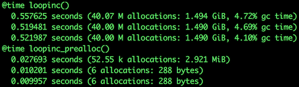
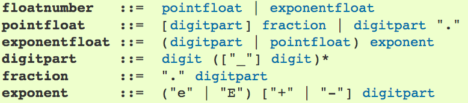
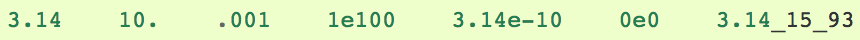
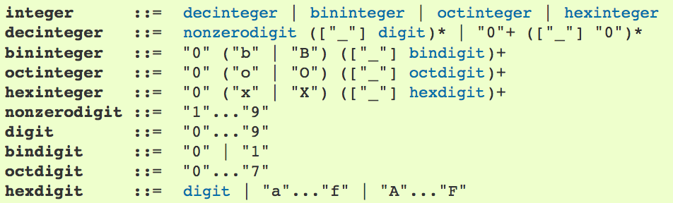
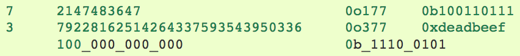

# \[Arrays, Types, FP\].ap(Julia, Python)

---

## Motivation
> [Why *Swift* for TensorFlow?](https://github.com/tensorflow/swift/blob/master/docs/WhySwiftForTensorFlow.md)[@zheng_why_2018]

:::notes
- Interestingly, Chris Lattner is the second "author" (contributor) of this paper.
:::

## Premise
> An inquiry into the engineering solutions provided by two (2) programming languages to the same problem set.

## Contract
- Fun
- Earnest inquiry
- Honest assessment
- Respectful communication
- Fun

:::notes
- There are many ways to make programs resillient but architecture sets limits; we need genuine insight to progress.
- Our opinions don't matter, this is a discussion about facts in closed systems.
- We don't need to change our minds to benefit from critical thinking.
- *If you see something...*
  - Ask questions.
  - Respectul counterpoints are welcome.
  - I may defer you to maintain flow.
  - I may not have a good answer. Those questions I'll write down and push to an accessible place later.
- We can have fun working together.
:::

## Flow
- Languages
- Ground Truths
- Types
- Arrays/Lists
- Functional Programming

:::notes
- Generics first.
  - Much content falls under "general knowledge".
  - We'll spend time here to save time when looking at language-specific implementations.
- Types in {Python, Julia} next.
  - Useful (to us) lanugage details.
  - Closer look at `Float`, `Int`, `Missing` and `{NULL?}`.
- Lastly, functional programming.
  - We need fundamentals to help this make sense.
  - Shrouded in nomenclature and inept interpretation.
  - No more difficult than other patterns, overwhelmingly less code for the same functionality.
- You can learn, you are capable.
- **NB** All example code in Julia because I am much more familiar with it.
:::

## Themes
- Psychological safety
- Asynchronicity contracts
- Structural obligations
  - Binding
  - Linear nesting

:::notes
- **NB** Don't memorize this list, I want to put a set of "cue frames" in your mind for the immedate future.
- "Go with what I know or ..."--fundamental to our interactions with the world.
- All operations are asynchronus!!
  - We can meaningfully talk about the difference between a future and a bound variable as "overhead of/time to access".
  - Language specific.
- software $\in$ hardware
  - Hence the mathematical descriptions, which are quite suitable for describing the structure of transformations.
:::

# Languages

---

## 
```python
# CPython
>>> sys.version_info
sys.version_info(major=3, minor=7, micro=0, releaselevel='final', serial=0)
```
```julia
# Julia
julia> versioninfo()
Julia Version 1.0.0
Commit 5d4eaca0c9 (2018-08-08 20:58 UTC)
Platform Info:
  OS: Linux (x86_64-linux-gnu)
  CPU: Intel(R) Core(TM) i5-5257U CPU @ 2.70GHz
  WORD_SIZE: 64
  LIBM: libopenlibm
  LLVM: libLLVM-6.0.0 (ORCJIT, broadwell)
```

:::notes
- v3.7.0
- v1.0.0
- See *Further Reading* $\to$ *Environments*.
:::

## Python Characteristics
- Mulitparadigm, interpreted (C)
- Dynamic typing
  - Not declarable, v3.5 introduced type [hints](https://docs.python.org/3/library/typing.html)
- "One (best) way"
- Small core library, widely modularizable
- Flexible

:::notes
- Well-represented in several major sectors.
- Undeniably "proven" as a language.
- Large, generally enthusiastic user community.
- Core library is quite robust given its size.
  - `xz` $\to$ `16.9MB`
  - uncompressed $\to$ `78.5MB`
:::

## Python Catch-22s
- Package du jour
- Late binding ("duck" typing)
- Pedantically idiomatic

:::notes
- Age of language partly to blame for "package du jour" (*see* Java).
- Late binding == crash on execution fail.
  - More on this ahead.
- "One (best) way" very much a matter of external and internal debate.
  - Does not imply "bad" (*see* list comps), only that we should interpret claims with caution.
:::

## Julia Characteristics
- Numerical computing, JIT (predominantly Julia)
- Dynamic typing
  - Optionally declared
- Multiple dispatch
- Well curated core libraries, extended with packages
- Highly performant

:::notes
- Rapidly expanding presence in high performance, high precision, and time critical environments.
  - Has performed a petaflop: "language list" now C, C++, Fortan, Julia.
- Quite odd for a dynamic langauge to include a full type system.
- Surprising number of non-CS disciplines in user community.
  - Similar to Python in this respect.
:::

## Julia Catch-22s
- Young
- Focused
- Antipatterns are real

[](https://docs.julialang.org/en/stable/manual/performance-tips/#Pre-allocating-outputs-1)

:::notes
- `v1.0.0` released 08-08-2018.
- CS/mathematical bearing. Excellent for computing, much less ecosystem support for gaming, UI, ...
  - HTTP is IO... Now you know why nearly every language supports it.
- Core features like multiple dispatch and type unions can be used to introduce significant performance issues.
:::

# Ground Truths

---

##
> Programming is blindly manipulating symbols. —Bret Victor

- Computers are stateless, recursive, finite systems
- John von Neumann gave the last word in *First Draft of a Report on the EDVAC*, distributed 30 June 1945
- The [Halting Problem](http://www.cgl.uwaterloo.ca/csk/halt/) is eternal
- The [Incompleteness Theorem](https://plato.stanford.edu/entries/goedel-incompleteness/) has no master

:::notes
- The definitions that follow are principally sound--language implementations will differ.
- Set theory can be used to *describe* many relations that do not involve sets.
  - Fine distinction, can be awkward. That's okay.
- **Math ahead!** What I want you to see is that there *exist* structured, well-defined relations *between* values.
:::

## $\emptyset$ (`Nothing`)
> Vacuous truth has untenably expansive state for a finite system. $\emptyset\to ()$ is a convention, **not** a definition.
>
>$\therefore$ We are not building on, we are building **round** $\emptyset$.

:::notes
- $P(\emptyset) = 0$ (probability of empty set axiom)
- Loosely, nothingness is a coproduct of somethingness and we need both for a complete view of the world.
- The coproducts introduced by interaction of these categories are consequential for automated reasoning.
  - I will return to this.
- Extending binary to ternary logic adds essential flexibility to structured reasoning.
  - `(false, null, true)` more expressive than `(false, true)`
- *Humans reason much more efficiently than algorithms about $\emptyset$.*
:::

## $\forall x \notin\emptyset$ (nonempty sets)
effects $F,G$, integer $n$, memory block $M$, messages $A,B$

| | |
|-|-|
| **message/value** | $\forall (M,n) \ge 0: A[M,M_{(M+n)}]$ |
| **push**[@staltz_why_2018] | $A \to F$ |
| **pull**[@staltz_why_2018] | $A \to F \to B$ |
| **future/promise**[@john_a_degoes_scalaz_2018] | $A \to F[B]$ |
| **actor**[@john_a_degoes_scalaz_2018] | $G[A \to F[B]]$ |

:::notes
- $M$ may **not** be empty because $\emptyset$ is represented as a type.
  - And a type is represented by bits.
  - This distinction is not necessary in mathematics.
- Don't worry if the symbols make sense, I know you can see the increase in nesting and changes to essential structure between definitions.
- *NB*
  - A map, or similar strategy, is required each time a pair of square brackets is encountered.
  - Push/Pull definition courtesy of André Staltz.
  - {Future/Promise, Actor} definition courtesy of John DeGoes.
:::

## $\forall x \notin\emptyset$
messages $A,B,C$

| | |
|-|-|
| **array** | $\forall B \nin\emptyset: B[A]$ |
| **nonempty array** | $\forall A,B \nin\emptyset:B[A]$ |
| **stream** | $\forall A,B,C \nin\emptyset:C[A,B]$ |

:::notes
- Streams are generally defined as promising (or greater) a *next* value.
:::

## $\forall x \notin\emptyset$
messages $A,B,C$, and types $T,U$

| | |
|-|-|
| **type** | $\forall T \in\emptyset: T$ |
| | $\forall T \nin\emptyset: T[]$ |
| **typed message** | $\forall A,T \nin\emptyset: T[A]$ |
| **typed stream** | $\forall A,B,T \nin\emptyset: T[A,B]$ |
| **streamed types** | $\forall A,B,C,T,U \nin\emptyset: C[U[A],T[B]]$ |

## $\forall$ (`Any`)
> "Total" truth is **necessarily** incomplete: the "set of all sets" $A$ cannot satisfy $\wp(A) \cup (A \subset A)$.
>
> $\therefore \forall$ is a **computable representation** of a "complete" set

:::notes
- Incompleteness!!
- "Very partially complete" (99.9999..\%) is quite awkward to reason about.
- $\emptyset$ and $\forall$ **do not** share an isomorphic relationship.
:::

## ...... ....... ....why?
> Computers perform recursive atomic operations on streams of electrons within a (theoretically) finite space. We need a differentiation strategy. This is expressed by a **type system**, which enforces ordered assumptions about memory structures.

:::notes
- *If you're just waking...*
- Types are used for differentiation of (essentially) stateless memory blocks.
  - Yes, this is loose.
- Turns out there is no imperative for users to explicitly define or interact with them.
  - High-demand enterprise systems deployed in Erlang, Javascript, Python.
  - Erlang keeps the telephony system operational.
- Strength of relation between assumption and result inconsistent.
:::

# Types

---

## 
> Any time behavior is determined by cases, there is a coproduct involved.[@spivak_category_2014]

:::notes
- A coproduct is the "equal and opposite" reaction... (recall I just mentioned differentiation)
- The quality of the coproducts' assertions depends on the definition of the products.
- All strategies introduce some degree of processing "overhead" on behalf of entropy reduction.
  - Entropy can be helpfully defined as diversity of types.
  - Entropy **costs**: *effort* to reduce, *predictability* to increase.
- Mathematical reasoning provides a lot of clarity here, so let's go talk to Tony...
:::

## Hoare Logic
> $\{P\}$ $C$ $\{Q\}$

| | |
|:-:|:-|
| **P** | Precondition |
| **C** | Command |
| **Q** | Postcondition |

> $f: P \to C \to Q$

:::notes
- You may operate on the postcondition to find the precondition. *The the other way is not valid*.
- Command may fire without precondition match.
  - Strength of gaurantee precondition is met correlates with predictability of output.
  - This is a key difference between Python and Julia, as we'll see in a few minutes.
- Starting to sound like entropy/variance/..? Great!
- Methods used for precondition match guarantees likely account for fundamental differences in performance between languages.
:::

## Python's Types
- Dynamic, Strong (since 3.5)
- $valid \lor crash$ (late binding)


:::notes
- Assigned by interpreter at runtime.
- Late binding tests commands with input.
- Julia also uses late binding via different mehods. *This is an important distincition between the languages.*
:::

## `float`[@python_docs_numeric_types_2018]<sup>,</sup>[@python_docs_numeric_literals_2018]
- "Wider" type than `Int`, "narrower" than `complex`
- "[U]sually implemented using double in C"[@python_docs_numeric_types_2018]

[](https://docs.python.org/3/reference/lexical_analysis.html#floating-point-literals)
[](https://docs.python.org/3/reference/lexical_analysis.html#floating-point-literals)

:::notes
- Superscripts in this section are references.
- I am unclear on "usually". Docs seem to imply distinction is based on operating environment.
- We can sketch a crude heirarchy of types from their crude relations.
- Bear in mind types are *intentionally simple* and have a utility roughly inverse the complexity of their definition.
- The *implementation* of a type is a different matter we will not examine today. Our interests lie in understanding how two programming languages utilize types.
:::

## `int`[@python_docs_numeric_types_2018]<sup>,</sup>[@python_docs_numeric_literals_2018]
- "Narrower" than float, "wider" than Boolean

[](https://docs.python.org/3/reference/lexical_analysis.html#integer-literals)
[](https://docs.python.org/3/reference/lexical_analysis.html#integer-literals)

:::notes
- Allows unlimited precision.
- **Numeric literals do not include a sign.**
  - `-1` is "an expression composed of the unary operator `-` and the literal `1`"[@python_docs_numeric_literals_2018]
:::

## `None`
> "The sole value of the type `NoneType`. `None` is frequently used to represent the absence of a value, as when default arguments are not passed to a function. Assignments to `None` are illegal and raise a [SyntaxError](https://docs.python.org/3/library/exceptions.html#SyntaxError)."[@python_docs_constants_2018]

:::notes
- The definition of `None` represents a *state*--absence.
- While $\emptyset$ types are are tricky to implement, **they are very strict in definition--rigorously *falsifiable*, in fact**
- A priori immutable.
- "Terminus" of type hierarchy.
:::

## Julia's Types
$$[\bot_{\emptyset},\top_{\forall}]$$

- Dynamic
- Parametrically polymorphic

:::notes
- $\bot$ and $\top$ represent "minmax" of type AST.
   - Successive specialization of types, allows insertion of new nodes.
- Julia requires type match before input is given to command ("not possible to execute command")
- Union{dynamic, full, parametrically polymorphic} is a rare feature list.
  - Parametric polymorphism is the foundation of generic programming.
- Contrast definitions below with "narrower" and "wider" above.
:::

## `Int`[@julia_int_flt_2018]
- `Core.Number`
  - `Core.Real`
    - `Core.Integer`
        - `Core.Signed` $\to$ `Int[8,16,32,64,128]`
        - `Core.Unsigned` $\to$ `UInt[8,16,32,64,128]`

:::notes
- This is subclassing in the *mathematical* sense.
- For programmers, this parameterizes a value (`typemin/max`).
- For the machine, it provides a tenably low-level definition of the structure (number of bits, meaning of slot) which *represents* a type.
- Isomorphisms like this are a first principle of design in the functional paradigm.
:::

## `Float`[@julia_int_flt_2018]
`Core.Number` $\to$ `Core.Real` $\to$ `Core.AbstractFloat` $\to$

| **Type** | **Precision** | **Number of bits** |
|:-:|:-:|:-:|
| Float16 | half | 16 |
| Float32 | single | 32 |
| Float64 | double | 64 |

:::notes
- "Rules above" apply.
- We can think of definitions like these as constituting a contract with the programmer.
- Details deep to this look progressively like machine code, which describe the physical layout of memory and assumptions that can be made about such an ordering.
- Note `{Core.AbstractFloat, Core. Integer}` fork at `Core.Real`
:::

## `Missing`
> [...] `missing` values **propagate** automatically when passed to standard operators and functions, in particular mathematical functions. Uncertainty about the value of one of the operands induces uncertainty about the result.[@julia_missing_2018]

:::notes
- Uncertainty is a serious contender for the greatest intellectual achievement of the 20th century.
- Propogation of uncertainty is extremely useful for reasoning.
  - Congruent with modern (quantum) physical models.
- *Mitigates unpredictable halting.*
  - `Union{Missing, T[, U, ...]}` increases reliability of precondition match; the "downstream" consequences of this are positive.
:::

## `Missing`
- Julia's representation of $\emptyset$
- `missing` is the singleton instance of `Missing`
  - Equivalent to R's `NA` and SQL's `NULL`
  - Behaves like them in most cases
- "[A] normal Julia object"[@julia_missing_2018]
  - Propogation rules must be defined like all other objects

:::notes
- Note difference in case: `object`, `Type`.
- Represents "bottom" of type AST (see above).
- Anticlimactic definition, thanks to the AST.
  - Complex parts of type definition in Julia are generic, easing the task of logically congruent refactoring.
:::

# Variable Binding

---

## Between Memory and Representation
- The variables programs operate on **must** be bound to memory structures
- Binding **must** occur before the compiler can operate on a memory block
- $S$ is a nonempty set of nonempty sets. $f:S \to \cup S$ is a choice function for $S$ if $\forall x \in S: \exists f(x) \in x$

:::notes
- We need to briefly consider variable binding before moving from types to their implementation(s).
- Binding strategies have strong implications for error propogation.
  - Micro- to nanosecond `async/await` loops.
  - Compiler's "response time contract" with programmer.
  - Defines set of possible strategies--e.g. `throw` is not the sole option.
  - Stack trace obfuscation.
- Axiom of Choice
  - **The Cartesian product of nonempty sets is nonempty.**
  - *For each indexed family* $S_n$ *of nonempty sets there exists an indexed family* $x_n$ *of elements such that* $\forall$... 
  - Choice functions provide *ordering schemes*, which selection is based on.
  - **NB** Axiom hooks a sharp left soon after this mile marker--generally does not need to be invoked for sets with definable ordering schemas.
:::

## Example
```julia
m(x) = (println("w00t"); println("z00t"); println(x^2));
# Which steps complete?
# Where does failure occur?
# Do we see the output of `println`?
m(3)                          # 1
m("w00t")                     # 2
m(BigInt(typemax(Int64)))     # 3
m(missing)                    # 4
m(*)                          # 5
m(2.3)                        # 6
m('c')                        # 7
```

:::notes
- `goto: REPL`
- Example of late binding $\land$ multiple dispatch
- Python attempts to execute `"w00t"` via `m` and fails when it cannot.
  - This behavior can be replicated in Julia with input type `Any`
- Julia attempts to find a function matching `{name: "m", airity: 1, type: Function}`, then searches the type AST for weaker matches.
  - `supertype(Function)` $\to$ `Any`, so search stops.
- Julia uses a type union to handle `m("w00t")`.
  - `methods(^)` $\to$ `[51] ^(s::Union{AbstractChar, AbstractString}, r::Integer) in Base at strings/basic.jl:674`
:::

# Arrays/Lists

---

## 
<!-- > Lists and arrays are memory structures with *some* guarantee of ordering. Common implementations tend to make isomorphism fragile or expensive, leaving significant feature and performance gaps at scale. The mathematical concept of *range*, typically defined as the *image* (of a function...?) helps us see why -->

:::notes
- Computationally, isomorphism is an ideal state because it reduces dependence on ordering.
- Lookup expense, guarantees, time, et cetera vary widely by structure.
- The degree of nesting, "distance"/time to access (time is roughly equivalent to distance for an $e^-$), and effeciency of "wrap/unwrap" operations are important variables here.
:::

## Python `list`
pointer P, types $A, T_0, \ldots, T_n$, and values $V_0, \ldots, V_n$

$$P \cap\emptyset: \emptyset$$
$$\forall A,T,V\in P: A[T_3[V_0], T_1[V_1], T_6[V_2], \ldots, T_n[V_m]]$$

:::notes
- $P$ is disjoint to the empty set--e.g. no members of $P$ are $\emptyset$
- Array of pointers to Python objects
  - Heterogenous
  - Room for `Missing/NaN/...`
- Type check each iteration
  - Recall each pair of `[]` indicates a mapping operation
  - Hinders performance
:::

## NumPy `array`
types A, T, and values $V_0, \ldots, V_n$

**value array** (are these pointers?)
$$\forall A,T,V \nin\emptyset: A_T[V_0, V_1, V_2, V_3, ..., V_n]$$

:::notes
- Homogenous
- "[M]eans for array-like Python objects to re-use each other’s data buffers intelligently whenever possible."[@numpy_array_interface_2018]
  - This statement is ambiguous to me.
- Type check on insertion succeeds or fails **operation**, NO room for `Missing/NaN/...`
- `Pandas` adds missing value support and other "convenience" features.
:::

## Pandas `DataFrame`, `Series`
- `Series`
  - 1-dimensional `ndarray` with axix labels. Homogeneously typed.
- `DataFrame`
  - 2-dimensional, size-mutable, potentially heterogenous tabular data structure with labeled axes.
  - "[D]ict-like container for `Series` objects."

:::notes
- Both hold "standard" Python objects.
:::

## Thoughts
- *Patterns*
  - Adding features via modules
  - Reduction of overhead via abstraction
- *Antipatterns*
  - Substantial increase in global state
  - Untyped list made strictly typed made more flexibly typed again

:::notes
- I interpret "intelligently whenever possible" (from last slide) as an enlargement of already bulky state.
- "Bolt on" abstraction.
  - Disarticulated layers (untyped made typed...).
  - Three packages required (Base, NumPy, Pandas) for missing value support.
:::

## Julia `Array`
[w, 0, 0, 0, t]

## Julia `DataFrame`

:::notes
- Deliberate similarities in appearance to Pandas `DataFrame`.
:::

# Functional Programming

---

## 
> "The study of nonlinear functions is like the study of nonelephants." –John von Neumann

:::notes
- In my experience, FP is a more consistent way of working between multiple languages.
- Operations like currying, mapping, partial application, et cetera manipulate well-defined state in a *straightforward and regular* way.
- These operations are easily definable as atomic (linearizable) operations—isolated (encapsulated), self-contained, and thread safe.
- Syntax will change due to language specifics, mechanics will not.
  - $f: A \to B$, `map::(a→b)→[a]→[b]`
  - $f \equiv map$
- A consequence of this is low implementation diversity; essentially, these operations are too simple to have many expressions.
:::

## Composition
$$f \circ g \circ h \circ p$$

```julia
f(x)="f($x)";g(x)="g($x)";h(x)="h($x)";p(x)="p($x)";

julia> (f ∘ g ∘ h ∘ p)("w00t")   # => "p(h(g(f(w00t))))"
```

:::notes
- You may enter `\circ` in the Julia REPL.
- `goto: REPL`
- Right-to-left!!
:::

## Laziness

:::notes
- "Fundamental of FP"
:::

## Monads
[](https://twitter.com/jdegoes/status/1022546801457475584/photo/1, "John A. DeGoes on ending 'The Monad Wars'")

:::notes
- "Math side of computing", structurally more akin to Category Theory.
- Chances are you're overspecializing monads--they're a way to implement the same things you do now.
  - What's compelling about monads is how they may be used to represent other programming paradigms, but the reverse is not true.
  - *Functions that compose via logically-associated operations.* ("nonlinear elephants" slide)
- Terms are awkward and differentiate from more accessible concepts by shades.
  - *I recommend we retain the nomenclature, as the small differences make big ones in practice.*
- Regarding JAdG graphic.
  - There is quite a difference here, and that difference is **global state**. ("nonlinear elephants" slide)
  - Polymorphism es muy bueno.
:::

## FP in Python
> Guido says
> 
> "Python has its own way...
> 
> ...and use list comprehensions."

## 
> The [Python 3.7.0 documentation](https://docs.python.org/3/library/functional.html) says
>
> "The modules described in this chapter provide functions and classes that support a functional programming style, and general operations on callables."[@python_docs_fp_modules_2018]

:::notes
- I am going to stick to the standard library—it offers us a great deal.
:::

## FP in Julia
> Multiple dispatch is quite functional

:::notes
- Designed and built by PhDs in math; project leader holds PhD in *linear algebra*.
- Multiple dispatch defines *systems of equations*.
:::

# Lastly

---

## Further Reading
- [Erlang's Tail Recursion is Not a Silver Bullet](https://ferd.ca/erlang-s-tail-recursion-is-not-a-silver-bullet.html)
- [First-Class Statistical Missing Values \[...\] in Julia 0.7](https://julialang.org/blog/2018/06/missing)
- [The Halting Problem](http://www.cgl.uwaterloo.ca/csk/halt/)
- [Julia Docs](https://docs.julialang.org/) $\to$ \{[Performance Tips](https://docs.julialang.org/en/stable/manual/performance-tips/), [Style Guide](https://docs.julialang.org/en/stable/manual/style-guide/)\}
- [Key differences: Python 2.7.x and Python 3.x](http://sebastianraschka.com/Articles/2014_python_2_3_key_diff.html)
- [Kinds of types in Scala, part 1: types, what are they?](https://kubuszok.com/2018/kinds-of-types-in-scala-part-1/)
- [Python 3 Q & A](http://python-notes.curiousefficiency.org/en/latest/python3/questions_and_answers.html)
- [The Seven Myths of Erlang Performance (see 2.1)](http://erlang.org/doc/efficiency_guide/myths.html)
- [Swift for Tensorflow: Documentation](https://github.com/tensorflow/swift#documentation)

## Environments
```bash
# Julia v1.0.0
docker run -it -p 127.0.0.1:13106:3000 --name julia1 -v ~/development/julia:/opt/julia -v ~/development/data:/opt/julia/data -w /opt/julia ubuntu:18.10 /bin/bash
apt update; apt upgrade --yes; apt autoremove --yes
apt install --yes build-essential cmake git gfortran imagemagick libatomic1 libedit-dev libncurses5-dev libpango1.0-dev libpng-dev m4 perl pkg-config python wget
git clone git://github.com/JuliaLang/julia.git
git checkout v1.0.0
make
```
```bash
# CPython 3.7.0
docker run -it -p 127.0.0.1:13107:3000 --name py370 -v ~/development/python:/opt/python -v ~/development/data:/opt/python/data -w /opt/python ubuntu:18.10 /bin/bash
apt update; apt upgrade --yes; apt autoremove --yes
apt install --yes build-essential cmake git libffi-dev libssl-dev m4 pkg-config wget zlib1g-dev
wget https://www.python.org/ftp/python/3.7.0/Python-3.7.0.tgz
./configure
make
make install
```

## Thank you!!
> <jason@grafft.co>

- <http://grafft.co>
- <http://github.com/jagrafft>

## References