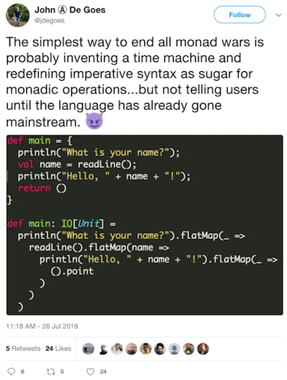

# Frontmatter

---

## Motivation
> [Why *Swift* for TensorFlow?](https://github.com/tensorflow/swift/blob/master/docs/WhySwiftForTensorFlow.md)

## Premise
> An inquiry into the engineering solutions provided by two (2) programming languages to the same problem set.

## Contract
- Fun
- Earnest inquiry
- Honest disagreement
- Respectful communication
- Fun

## Flow
- Languages
- Ground Truths
- Types
- Arrays/Lists
- Functional Programming

:::notes
- Generics first
    - We'll spend time here to save time when looking at language-specific implementations.
- Types in {Python, Julia} next
    - Lanugage specifics
    - Closer look at `Float..`, `Int..`, `Missing/Null/...`
- Lastly, functional programming
    - We needed coverage of language fundamentals and types to help this make sense.
    - Shrouded in nomenclature and inept thinking -> you can learn, you are capable.
:::

# Languages

---

##
```python
# Python
>>> sys.version_info
sys.version_info(major=3, minor=7, micro=0, releaselevel='final', serial=0)
```
```julia
# Julia
julia> versioninfo()
Julia Version 0.6.2
Commit d386e40c17 (2017-12-13 18:08 UTC)
Platform Info:
  OS: Linux (x86_64-pc-linux-gnu)
  CPU: Intel(R) Core(TM) i5-5257U CPU @ 2.70GHz
  WORD_SIZE: 64
  BLAS: libopenblas (USE64BITINT DYNAMIC_ARCH NO_AFFINITY Haswell)
  LAPACK: libopenblas64_
  LIBM: libopenlibm
  LLVM: libLLVM-3.9.1 (ORCJIT, broadwell)
```

## Python Characteristics
- Mulitparadigm, interpreted (C)
- Dynamic typing
  - Not declarable, run time "check"
  - v3.5 introduced type [hints](https://docs.python.org/3/library/typing.html)
- Small core library, widely modularizable
- Flexible

## Python Catch-22s
- "Ten day language" problem
- Package du jour
- Pedantically idiomatic

## Julia Characteristics
- Numerical computing, JIT (predominantly Julia)
- Static typing
  - Optionally declared, compiler enforced
  - User types fast as base types
- Well curated core libraries, extended with packages
- Highly performant

## Julia Catch-22s
- Breaking changes
- 2
- 3

# Ground Truths

---

##
> Programming is blindly manipulating symbols. —Bret Victor

- Computers are stateless, recursive finite systems
- Architecture choices impose hard limits
- Efficiency via general purposing is an oxymoron
- John von Neumann gave the last word in *First Draft of a Report on the EDVAC*, distributed 30 June 1945

## $\emptyset$ (nothingness)
> Vacuous truth has untenably expansive state for a finite system. $\emptyset\to ()$ is a convention, **not** a definition.
>
>$\therefore$ We are not building on, we are building **round** $\emptyset$.

## $\forall x \notin\emptyset$ (nonempty sets)
for messages $\{A,B\}$, effects $\{F,G\}$, and types $\{T,U\}$

- **push:** $A \to F$
- **pull:** $A \to F \to B$
- **future/promise:** $A \to F[B]$
- **actor:** $G[A \to F[B]]$

:::notes
- A *map*, or similar strategy, is required each time a pair of square brackets is encountered.
:::

## $\forall x \notin\emptyset$
messages $\{A,B,C\}$, memory block $\{x\}$, and integer $\{n\}$

- **message/value:** $\forall x,n \ge 0 \lor x \in\emptyset: A[x,x_{(x+n)}]$
- **array:** $\forall B \nin\emptyset: B[A]$
- **nonempty array:** $\forall \{A,B\} \nin\emptyset:B[A]$
- **stream:** $\forall \{A,B,C\} \nin\emptyset:C[A,B]$

## $\forall x \notin\emptyset$
messages $\{A,B,C\}$ and types $\{T,U\}$

- **type:** $\forall T \nin\emptyset: T[]$
- **typed stream:** $\forall \{A,B,T\} \nin\emptyset: T[A,B]$
- **streamed types:** $\forall \{A,B,C,T,U\} \nin\emptyset: C[U[A],T[B]]$

## ...... .........   ................ ....why?
> Computers perform recursive atomic operations on streams of electrons within a (theoretically) finite space. We need a differentiation strategy. This is expressed by a **type system**.

:::notes
- Here we step from physics to the physical world.
:::

# Types

---

## Python Types

## Python's `Float..`

## Python's `Int..`

## Python's `Null/Missing/...`

## Julia Types

## Julia's `Float64`

## Julia's `Int64`

## Julia's `Missing`

# Arrays/Lists

---

## Python Lists

## NumPy Lists

## Pandas Arrays

## Julia Arrays

# Functional Programming

---

## 
[](https://twitter.com/jdegoes/status/1022546801457475584/photo/1, "John A. DeGoes on ending 'The Monad Wars'")

:::notes
- There is quite a difference here, and that difference is **global state**.
:::

# Lastly

---

## Further Reading
- [Erlang's Tail Recursion is Not a Silver Bullet](https://ferd.ca/erlang-s-tail-recursion-is-not-a-silver-bullet.html)
- [First-Class Statistical Missing Values \[...\] in Julia 0.7](https://julialang.org/blog/2018/06/missing)
- [Julia Docs](https://docs.julialang.org/)
  - [Performance Tips](https://docs.julialang.org/en/stable/manual/performance-tips/)
  - [Style Guide](https://docs.julialang.org/en/stable/manual/style-guide/)
- [The Seven Myths of Erlang Performance](http://erlang.org/doc/efficiency_guide/myths.html)
    - *2.1 Myth: Tail-Recursive Functions are Much Faster Than Recursive Functions*
- [Swift for Tensorflow: Documentation](https://github.com/tensorflow/swift#documentation)

## Thank you!!
> <jason@grafft.co>

- <http://grafft.co>
- <http://github.com/jagrafft>