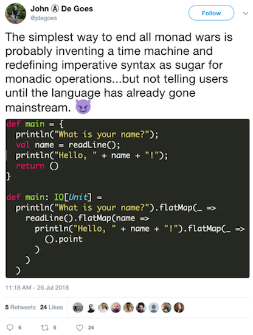

## Composition
$$f \circ g \circ h \circ p$$

```julia
f(x)="f($x)";g(x)="g($x)";h(x)="h($x)";p(x)="p($x)";

julia> (f ∘ g ∘ h ∘ p)("w00t")   # => "p(h(g(f(w00t))))"
```

:::notes
- You may enter `\circ` in the Julia REPL.
- `goto: REPL`
- Right-to-left!!
:::

```julia
# Composition
# (f ∘ g ∘ h ∘ p)("w00t") => "f(g(h(p(w00t))))"
# (f ∘ g ∘ h ∘ p)(99.99) => "f(g(h(p(99.99))))"
f(x)="f($x)";
g(x)="g($x)";
h(x)="h($x)";
p(x)="p($x)";
```

## Monads
[](https://twitter.com/jdegoes/status/1022546801457475584/photo/1, "John A. DeGoes on ending 'The Monad Wars'")

:::notes
- "Math side of computing", structurally more akin to Category Theory.
- Chances are you're overspecializing monads--they're a way to implement the same things you do now.
  - What's compelling about monads is how they may be used to represent other programming paradigms, but the reverse is not true.
  - *Functions that compose via logically-associated operations.* ("nonlinear elephants" slide)
- Terms are awkward and differentiate from more accessible concepts by shades.
  - *I recommend we retain the nomenclature, as the small differences make big ones in practice.*
- Regarding JAdG graphic.
  - There is quite a difference here, and that difference is **global state**. ("nonlinear elephants" slide)
  - Polymorphism es muy bueno.
:::