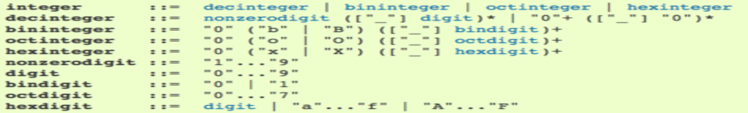

## Conceptual Framework
> The Seven Tools of Causal Inference with Reflections on Machine Learning[@pearl_seven_2018]
>
> Judea Pearl

:::notes
- Analogous to Steph's *ML Pipeline*, but more rigorous and better suited to my task.
:::

## Tool 1: Encoding Causal Assumptions--Transparency and Testability
1. Representational accuracy of dataset
    - Captures sufficient degree of source state
2. Self localization of data points
    - Context for a data point is provided by its neighbors
3. Valid structural model
    - Correctly abstracts common elements of dataset and their relations

:::notes
- Recall these data are extracted from another source (in my case, transcribed from a video).
- A *compression function* defines the reconstruction process.
- The data model encodes valid structural relations between elements.
- The data model guides the compression function--representational accuracy is defined by how these structures interact iteratively.
:::

## Tool 2: *Do*-calculus and the control of confounding
- *Do*-calculus not yet implemented

## Tool 3: The Algorithmization of Counterfactuals

## Tool 4: Mediation Analysis and the Assessment of Direct and Indirect Effects

## Tool 5: Adaptability, External Validity and Sample Selection
1. Task description
2. Data modeling
3. Data collection

## Task description
> Rapid sequence induction and intubation (RSII) of a standardized simulated patient.

## `model:` Record
A **Record** is a time series. It is *atomic* and thus immutable: changes in state violate meaning.

> $\forall R,\ell,t \nin \emptyset; n,m \ge 0: R_m \to \{t_0 \to \ell_0, \ldots, t_n \to \ell_n\}$

:::notes
- *Atomic* is here used to mean an irreducible unit.
- "Violation of meaning" asserts an a priori effect on the validity of downstream assertions.
:::

## `model:` Time Series
A **Time Series** is a 1-dimensional\* array of pairs $t_n \to \ell_n$ orderable from smallest to largest by $t_n$. It may be operated on as a stream without violating immutability.

<small>\* Because $t \to \ell$ is a one-way relation, indicating $\ell$ is dependent on $t$ for meaning.</small>

:::notes
- More precisely, the meaning of $t$ has greater resilience to erosion than the meaning of $\ell$.
:::

## Collection
- Filmed study population performing standardized simulation case
- Two (2) raters (1 expert, 1 lay) reviewed footage

||A|B|C|D|...|
|:-:|:-:|:-:|:-:|:-:|:-:|
|$t_0$|start|||||
|99|2|3|4|5|6|
|$\ldots$|$\ldots$|$\ldots$|$\ldots$|$\ldots$|$\ldots$|
|99|2|3|4|5|6|
|$t_{max}$|end|||||

## {{EXAMPLE TABLE}}

## Tool 6: Recovering from Missing Data
> "Using causal models of the missingness process we can now formalize the conditions under which causal and probabilistic relationships can be reovered from incomplete data and, whenever the conditions are satisfied, produce a consistent estimate of the desired relationship."[@pearl_seven_2018]

## Tool 7: Causal Discovery
- Dataflow programming (citations)

## Thank you!!
> <jgrafft@gmail.com>

- <https://grafft.co>
- <https://github.com/jagrafft>
- <https://beta.observablehq.com/@jagrafft>

## References