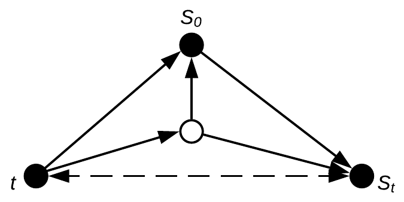
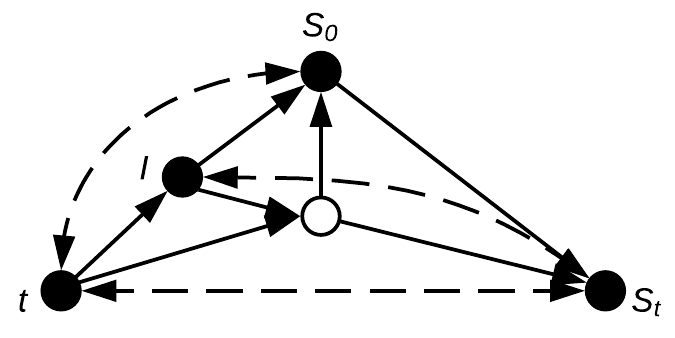
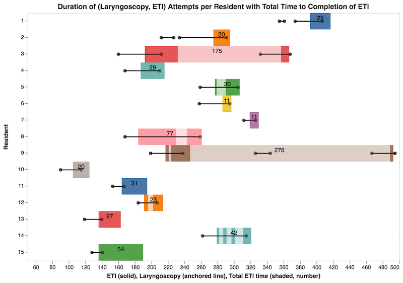
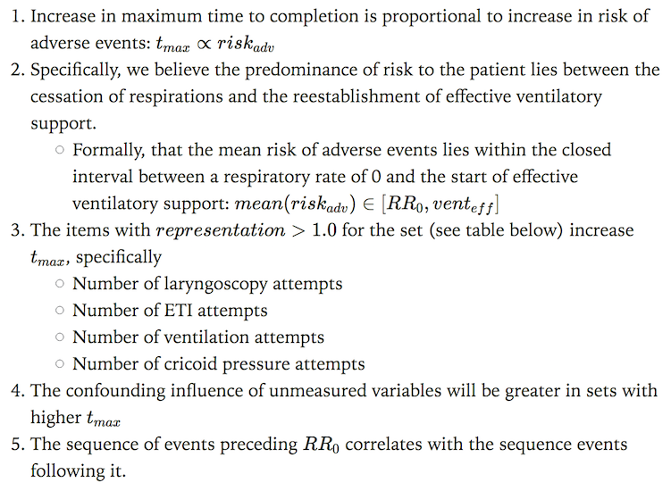
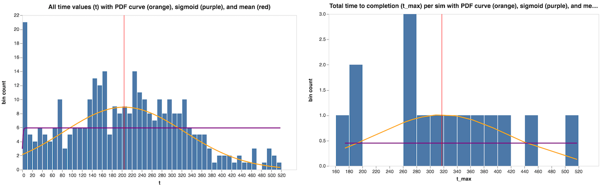
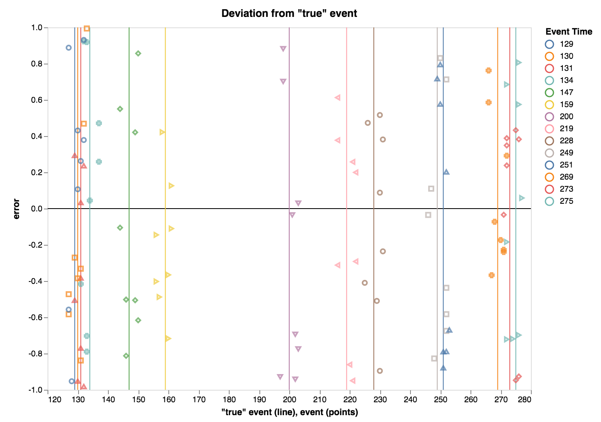
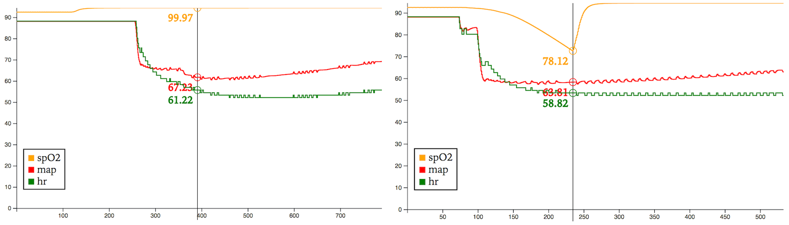

## Modeling
- A patient $P$ presents with initial state $S_0$, evolving under the influence of time $t$ and an unmeasured confounding variable into $S_{t}.^a$

## Psychomotor Task Model
- An intervention $I$ confounds the relationship of $t$, $S_0$, $S_t$, and the unmeasured variable in *predictable and unpredictable* ways.$^b$

## Data
- Filmed study participants during simulated case
- Two (2) raters reviewed footage
- Created a psychomotor event log for each case

|t|event|code|state|result|notes|
|:-:|:-:|:-:|:-:|:-:|---|
|0.0|start|||||
|56.0|drug|Fentanyl|bolus|100mcg|Stated '2.0mcg/kg'|
|97.0|drug|Lidocaine|bolus|70mg||
|101.0|drug|Propofol|bolus|150mg|Stated '2mg/kg'|
|119.0|drug|Succinylcholine|bolus|70mg|Stated '1mg/kg'|
|160.0|laryngoscopy|start|manual|||
|192.0|eti|start||||
|212.0|laryngoscopy|stop|manual|||
|232.0|eti|stop||||
|243.0|ventilations|start|manual|||
|249.0|check|breath sounds||bilateral||
|257.0|recognize|monitor|etCO2|active||
|259.0|end|||||

## Data Integrity
> A minority of orderings are valid, and raters "blind" downstream consumers

- Essential items
    - Chronology, pairing of events
    - Coding and spelling
    - Drug dosing

## Key Algorithms
- `countunique`
    - Coding and spelling errors
    - Provides rough measure of set "orthodoxy"
    - Histograms, other frequency statistics
- `destructure`
    - Deconstructs `DataFrame` into `Array{Tuple{Symbol, Array}}`
- `tuplesbykey`
    - Extracts combinations

## Pairing, coding and spelling errors
||event:code|count|representation||event:code|count|representation|
|:-:|---|:-:|:-:|:-:|---|:-:|:-:|
|1|ask:equipment|1|0.07|19|check:breath sounds|10|0.67|
|2|check:monitor|1|0.07|20|check:equipment|10|0.67|
|3|drug:Phenylephrine|1|0.07|21|preoxygenate:start|12|0.80|
|4|eti:adjust|1|0.07|22|preoxygenate:stop|12|0.80|
|5|recognize:eti|1|0.07|23|drug:Lidocaine|13|0.87|
|6|suction:start|1|0.07|24|drug:Succinylcholine|13|0.87|
|7|suction:stop|1|0.07|25|recognize:monitor|14|0.93|
|8|ask:monitor|2|0.13|26|end:missing|15|1.00|
|9|check:medications|2|0.13|27|start:missing|15|1.00|
|10|check:reflex|2|0.13|28|drug:Propofol|16|1.07|
|11|extubation:missing|2|0.13|29|ventilations:start|17|1.13|
|12|ventilations:stop|2|0.13|30|cricoid pressure:start|20|1.33|
|13|ask:patient|3|0.20|31|cricoid pressure:stop|20|1.33|
|14|cricoid pressure:switch|3|0.20|32|laryngoscopy:start|20|1.33|
|15|drug:Rocuronium|4|0.27|33|laryngoscopy:stop|20|1.33|
|16|ask:assistant|7|0.47|34|eti:stop|23|1.53|
|17|drug:Fentanyl|8|0.53|35|eti:start|24|1.60|
|18|recognize:fasciculations|9|0.60|

## Chronology and pairing of events

## Hypotheses

## Statistics
||count|unique|missing|mean|minimum|1st|median|3rd|maximum|$\sigma$|$\sigma^2$|skew|kurtosis|
|---|:-:|:-:|:-:|:-:|:-:|:-:|:-:|:-:|:-:|:-:|:-:|:-:|:-:|
|$t$|325|223|0|204.27|0.00|122.00|206.00|290.00|518.00|121.10|14666.22|0.22|-0.44|
|$t_{max}$|15|15|0|317.60|174.00|266.50|309.0|378.00|518.00|98.77|9754.97|0.28|-0.59|

##

## Validity
> Given $S_t$, biomedicine can often predict a range of potential future states and assign a probability to most

$range((P_{S_{(t+n)_a}}, S_{(t+n)_a}) \to (P_{S_{(t+m)_{\ldots}}}, S_{(t+m)_{\ldots}}))$

> A well-curated set of heuristics for composing empirical evidence guides this process. **Mechanical ones must match.**$^c$

## Next Steps
- Asserting meaningful causality from these data necessitates integrating metatdata
    - Clinical
    - Physiologic
    - Expert opinion
    - **Expert practice**
    - Biometric

## BioGears Physiology Simulation Engine Output Plots

## Machine Learning
- Data programming[@ratner_data_2016; @ratner_snorkel_2017]
- Formalization in *do*-Calculus[@pearl_do-calculus-rev_2012; @pearl_seven_2018]
- Modeling of expert heuristic bias[@taniguchi_machine_2018; @battaglia_relational_2018]
- Logical value of "data generation" techniques
- Models for integration of biometric, clinical, physiologic, and expert opinion and practice

## Thank you!!
> <jgrafft@gmail.com>

- <https://grafft.co>
- <https://github.com/jagrafft>
- <https://beta.observablehq.com/@jagrafft>

## Endnotes

$^a$ $S_0, \ldots, S_t$ are likely posets. Reflexivity and transitivity are relatively easy to demonstrate in the physical models of biomedicine. I suspect antisymmetry holds as well, but have not investigated this property.

$^b$ In biomedicine, it is helpful to understand all applications as partial.

$^c$ In essence, aggressive data collection and review has facilitated valid association of inputs with outputs, providing some way of calculating the "other end" of a black-box model given a left or right input.

## References