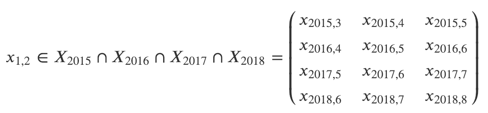
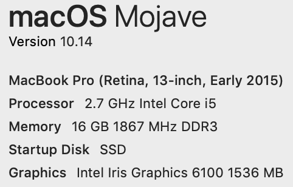
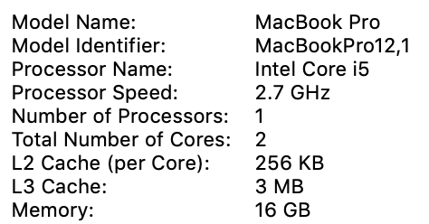

## Objectives
- Julia basics
- Data preparation and import, with Julia
- Apply Julia functions to California Smarter Balanced exam data

## Context
- Technical discussion using a sociopolitically-connotated dataset
- Exploration and learning
- Actual trends
- Meaningful interpretation requires meaningful experience
    - Opinions should be advanced with caution under this auspice

## Contract
1. Be respectful
2. Ask questions
3. Have fun!

# Smarter Balanced Assessment

---

## &nbsp;
- Large-scale standardized exam used by fourteen (14) states
- Unresolved validity questions
- Two tests
    - English Language Arts
    - Mathematics
- Administered to grades 3–8, 11

## Context of Results
- Heavily politicized
    - Big \$\$\$
    - Expert created and maintained
    - Controlled by first-place in popularity contest
    - Big influence for a priveldged few
- Difficult to adminstrate
- Education psychobabble
- Awkward (and useful) population grouping

## Large-Scale Test Construction
- By-and-large, measurement validity is high
- Deeply architected content associations
- Published results are heavily normalized via a (reliatively) long chain of (internal) adjustments
    - An increase in scores from year-to-year is generally expected

# The Data

---

## &nbsp;
### State of California Smarter Balanced Assessment Results from 2015 to 2018

## Sources
<small>`text/plain; charset=us-ascii`</small>

|year|rows|columns|MB|
|:-:|:-:|:-:|:-:|
| 2015 | 3,202,982 | 33 | 433.5 |
| 2016 | 3,116,796 | 33 | 434.6 |
| 2017 | 3,264,974 | 32 | 541.2 |
| 2018 | 3,269,731 | 32 | 541.7 |
| | 12,854,483 | | 1951.0 |

## Set
- Three cohorts $(\hat{i} = 3)$
- Four years $(\hat{j} = 4)$
- Two tests $(\hat{k} = 2)$

$(\hat{i}, \hat{j}, \hat{k}) = (3,4,2)$

## Integrity Issues
- $\emptyset$ significant digits
    - 2015–2016 `Vector{Int}`
    - 2017-2018 `Vector{Float}`
- Vectors *vertically indepdendent* and **horizontally dependent**
- 2017 results

# Data Preparation

---

## Execution Environment
|||
|:-:|:-:|
|||

## 
> `data_preparation.md`

# Applying Julia Functions

---

## &nbsp;

# Thank you!!
## &nbsp;
> <jgrafft@gmail.com>

- <https://grafft.co>
- <https://github.com/jagrafft>