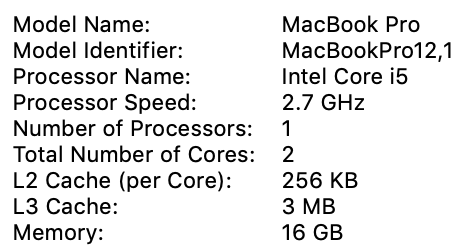

# Standard Examinations at Scale

---

## Features
- Legally defensible
    - Pedantic content associations, defined by committee
- Obtuse reporting
    - Categorical results with dynamic score ranges
- High difficulty construction and maintenance
    - Diverse group of experts, many support personnel, much time and more money required

:::notes
- ***This section is deliberately "loose" in the interest of time.***
- Educational testing, **especially** concerning public education, is the effort of experts and domain of politicians
- Score ranges typically valid for a given time period
- "Below", "Near", "Above", "Well Above" common (loosely)
- Obscured reporting is intended to preserve exam validity, and generally does a good job
- "Startup" cost ~$12M as of *2009*, significant upkeep
:::

## Existential Context
- Education psychobabble
    - Words connected by farcical assumptions stamped by a committee do not make fact (e.g. constructivism)
- Nauseating political confounding
    - Expert created; decision-makers placed first in popularity contest
    - Big \$\$\$
    - Big inluence for a priveldged few

:::notes
- Almost everyone has an opinion because almost everyone has a stake in the process or outcome
- Money and perception of "impact" greatly increase desireability of control
- "Entry point" of uncertainty--more on uncertainty soon\*
:::

## "Under the Hood"
- By-and-large, measurement validity is high
- Deeply architected content associations
- Published results are heavily normalized via a (reliatively) long chain of (internal) adjustments\*

\* - An increase in scores from year-to-year is expected

:::notes
- The test measures what it claims
- Abstract items (e.g. competencies) have a *defined and documented* chain of association to measurement items (e.g. items)
- Scores are normalized internally and to historical data prior to publication
    - *Actual approach varies by test*
- Exam security, validity, and defensibiilty are strong motivators for obfuscating results
    - Certain violations of integrity mean the exam *cannot likely be made valid again*
- Last item foreshadows *TK* below
:::

## Statewide Testing for K-12
- Federal and/or State mandates compel collection, measurement, and reporting of "education progress" data
    - Typically administered by districts
    - Most often this is a requirement for funding
- Quite often, these mandates require Districts and Schools demonstrate annual increase

:::notes
- Such factets as yearly increases in progress may be engineered because these types of exams are heavily normalized
:::

# <small>California Department of Education</small> Smarter Balanced Assessment System

---

## Why California?
- Commensurate data from Minnesota was difficult to obtain
- Home
- Student using data
    - Personal connections to CA Public Education politics
- Volume

## TK
- Created by a consortium of TK states
    - TK using
- Opaque governance
- Potentially serious validity issue

:::notes
- *Bit of history okay...*
:::

## Exam
- 

# Data

---

## Execution Environment
|||
|:-:|:-:|
|||

## Set
<small>`text/plain; charset=us-ascii`</small>

|year|rows|columns|MB|
|:-:|:-:|:-:|:-:|
| 2015 | 3,202,982 | 33 | 433.5 |
| 2016 | 3,116,796 | 33 | 434.6 |
| 2017 | 3,264,974 | 32 | 541.2 |
| 2018 | 3,269,731 | 32 | 541.7 |
| | 12,854,483 | | 1951.0 |

:::notes
- Encodings increase computational overhead
- Docker is a resource limitation
- Too much for a laptop
:::

## Catch-22s
- $\emptyset$ significant digits
    - 2015–2016 `Vector{Int}`
    - 2017-2018 `Vector{Float}`
- $(\hat{i}=3, \hat{j}=4, \hat{k}=2$)
    - Three cohorts spanning four years and two tests
- Vectors *vertically indepdendent* and **horizontally dependent**

:::notes
- Horizontal dependence is hugely confounding in this domain
:::

## Integrity Issue
- Marginal gains from 2016—2017
    - 12 of 13 consortium states showed negative
    - CA slight positive
    - English Langauge Arts much worse than Mathematics

:::notes
- ¡Uncertainty!
    - Foundational epistemic uncertainty critically degrages inductive model results
    - Aleatory uncertainty also affected, but structural defects are less of a problem for associative assertions
:::

## Cohorts

# Analyses

---