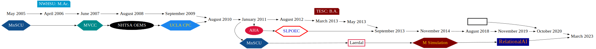
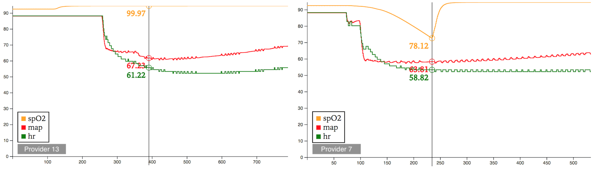
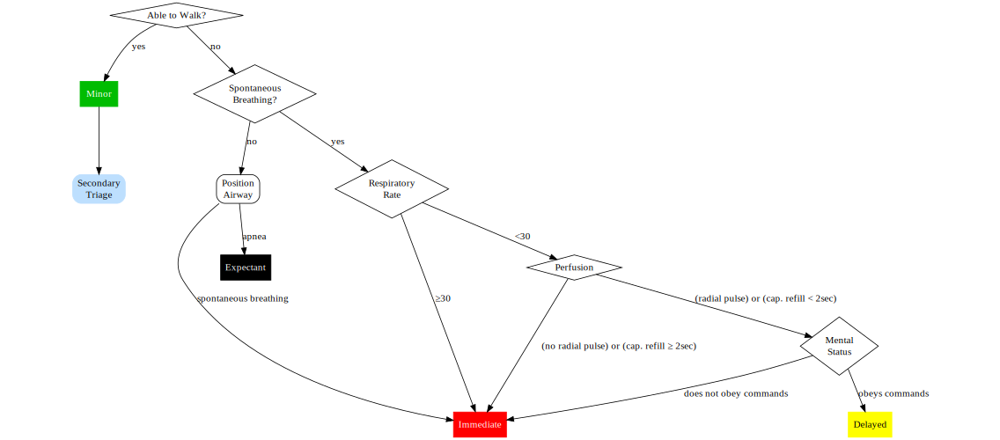
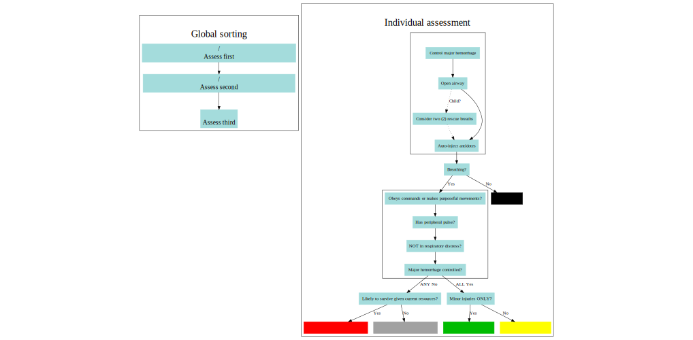
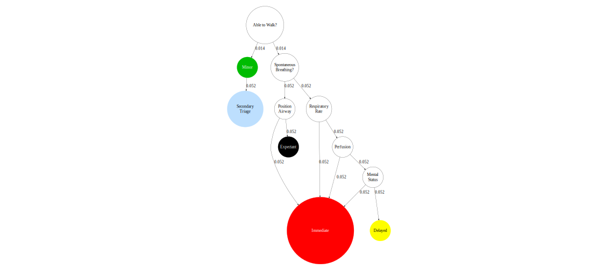
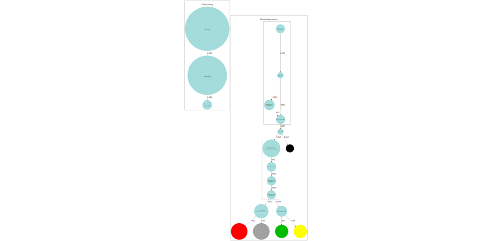

title: 2023 SLPOEC Career Panel
author: Jason A. Grafft
professional: Graph Engineer, RelationalAI
email: jason@grafft.co

# &nbsp;

 

     {{title}}
   
     <!--{{subtitle}}//-->
 

 
 

  {{author}}
   
        {{professional}}
         
  <a href="mailto:{{email}}" style="color: #404d5b;">{{email}}</a>
 

---

# Before We Begin

1. I will move _FAST_
  - Best to take notes that help you ask questions at the end
1. You may reach out to me
  - Ask Bill
1. My "story" is not important
  - Listen for how myself and others have _adapted_

---

# My Career

### Fields I Tried Out

- Academia
- Acute care
- Information Technology

--
  - $\to$ Information Science (best "fit" _for me_)

--

### Plausible Reasons for "Fit"

- ADHD
- Fascinated by the behavior of complex systems

---

# High-Fidelity Simulation Research

- M Simulation (prior)
  - with Mojca Remskar, MD, PhD

<h3 style="font-size: 18pt;">RSII Performed by an Anesthesiology Resident</h3>

<small>

| $t$   | event        | code            | state  | result    | notes              |
|:-----:|:------------:|:---------------:|:------:|:---------:|--------------------|
| 0.0   | start        |                 |        |           |                    |
| 56.0  | drug         | Fentanyl        | bolus  | 100mcg    | Stated '2.0mcg/kg' |
| 97.0  | drug         | Lidocaine       | bolus  | 70mg      |                    |
| 101.0 | drug         | Propofol        | bolus  | 150mg     | Stated '2mg/kg'    |
| 119.0 | drug         | Succinylcholine | bolus  | 70mg      | Stated '1mg/kg'    |
| 160.0 | laryngoscopy | start           | manual |           |                    |
| 192.0 | eti          | start           |        |           |                    |
| 212.0 | laryngoscopy | stop            | manual |           |                    |
| 232.0 | eti          | stop            |        |           |                    |
| 243.0 | ventilations | start           | manual |           |                    |
| 249.0 | check        | breath sounds   |        | bilateral |                    |
| 257.0 | recognize    | monitor         | etCO2  | active    |                    |
| 259.0 | end          |                 |        |           |                    |

</small>

--

- This cost over one-thousand dollars ($1000) to generate
- _Highly_ similar to most other records, $\uparrow\uparrow\uparrow$ cost of human review

---

# High-Fidelity Simulation Research

- M Simulation (prior)
  - with Mojca Remskar, MD, PhD

    

    

  
--

Provider 13's performance is clearly closer to ideal.

---

# Information Science: PageRank

- RelationalAI (current)
  - with Huda Nassar, PhD

### _"Where are you most likely to go, randomly?"_

  

    
  

  

    <ul>
      <li>Number of arrows pointing to <em>Immediate</em> is a serious problem</li>
      <li>Specially for helicopters</li>
      <ul>
        <li><a href="https://www.popularmechanics.com/flight/a5814/medical-helicopter-safety-crashes/">Unacceptable Risk: The Troubling Medical Helicopter Safety Record</a></li>
        <li><a href="https://www.popularmechanics.com/flight/a5937/how-to-improve-medical-helicopter-safety/">How to Improve Medical Helicopter Safety</a></li>
      </ul>
    </ul>
  

---

# Information Science: PageRank

- RelationalAI (current)
  - with Huda Nassar, PhD

<!-- https://www.mayoclinic.org/medical-professionals/trauma/news/mass-casualty-triage-guidelines-revised/mac-20512735 //-->

  

    
  

  

    <ul>
      <li><a href="https://em.umaryland.edu/files/uploads/ems/salt_2008.pdf">SALT Mass Casualty Triage</a></li>
      <li>Improvement on START</li>
      <ul>
        <li><a href="https://www.wmpllc.org/ojs/index.php/ajdm/article/view/664">Comparison of START and SALT Triage Methodologies to Reference Standard Definitions and to a Field Mass Casualty Simulation</a></li>
      </ul>
      <li>💩 algorithm design</li>
    </ul>
  

---

# Information Science: PageRank

- RelationalAI (current)
  - with Huda Nassar, PhD

  

    
  

  

    
  

--

- Improved representation of how each triage method affects large groups of people
- Easier to see how START overuses critical care
- Bias toward overtriage seems to be retained by SALT (noted by study authors)
- Validates some design claims of SALT

<small>
   
<a href="img/START_pagerank_graphviz.svg" target="_blank">START diagram</a>
 
<a href="img/SALT_pagerank_graphviz.svg" target="_blank">SALT diagram</a>
</small>

---
layout: false
name: last-slide 

# &nbsp;

  Thank You!

